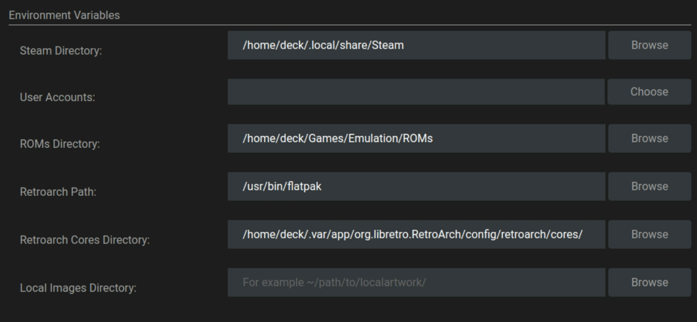
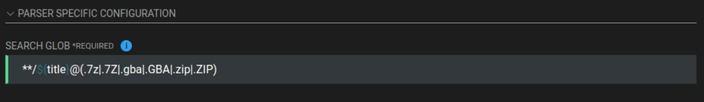

# First Steps

## First Steps Table of Contents
[Back to the Top](#first-steps-table-of-contents)

[TOC]

??? info "The Basics"
    {{ home }} 

    {{ hiddenfolders }}
    
    {{ applications }}

## How to Set up a Basic Emulation Directory
[Back to the Top](#first-steps-table-of-contents)

!!! info

    This page assumes you will use the paths in the section below. You are not required to use these paths. However, it is recommended you keep the folder names for consistency across the sections on this page. For example, if you are using an external storage device, it is recommended you use something like `/run/media/deck/Emulation` as your base folder.

1. In the `$HOME` folder, create a `Games` folder if one does not exist :material-information-outline:{ title="{{ steamdeckdesktopmode }}" }
2. In the `$HOME/Games` folder, create an `Emulation` folder
3. In the `$HOME/Games/Emulation` folder, create the following folders:
   * `BIOS`
   * `ROMs`
   * `Saves`
     * In the `Saves` folder, create a `States` folder
   * `Screenshots`
4. The final directory should look like the following image:
    * 

## How to Set up ES-DE and the ROM Folders
[Back to the Top](#first-steps-table-of-contents)

1. Open the ES-DE website, [https://es-de.org/#Download](https://es-de.org/#Download) :material-information-outline:{ title="{{ steamdeckdesktopmode }}" }
2. If on a Linux desktop, click the `Linux x64 AppImage` button. If on a Steam Deck, click the `Steam Deck AppImage`
3. Move the downloaded AppImage to `$HOME/Applications`.
4. Right click the AppImage, {{ permissions }}
5. (Optional) For easier maintenance, rename the AppImage to `ES-DE.AppImage`
6. Double click the AppImage to run ES-DE
7. On the ES-DE onboarding screen, click `CHANGE` and update the path to `$HOME/Games/Emulation/ROMs`
    * 
8. Click the checkmark to confirm the path
9. On the onboarding screen, click `CREATE` to allow ES-DE to create the ROM folders in `$HOME/Games/Emulation/ROMs`
    * 
10. Once ES-DE has created the folders, click `QUIT`
11. ES-DE and the ROM folders are now configured

## How to Set Up and Configure RetroArch
[Back to the Top](#first-steps-table-of-contents)

### How to Install RetroArch
[Back to the Top](#first-steps-table-of-contents)

1. Open your distro's software manager. :material-information-outline:{ title="{{ steamdeckdesktopmode }}" }
    * {{ discover }}
2. Search for "RetroArch" and click "Install" on the top right of the software page For RetroArch
3. Open Konsole or a terminal of your choice
4. Type the following two lines, one at a time, and press enter after each line:
    * `flatpak override org.libretro.RetroArch --filesystem=host --user`
    * {{ flatseal }}

### How to Configure RetroArch
[Back to the Top](#first-steps-table-of-contents)

1. Launch RetroArch :material-information-outline:{ title="{{ steamdeckdesktopmode }}" }
2. Click `Settings` on the left-hand side of the screen
3. Scroll down to `Directory`
4. Use the following format:
    * For directores that start with `/app`, click `Parent Directory` until you see `$HOME/.var/app/org.libretro.RetroArch/config/retroarch`
    * `System/BIOS`
      *  `$HOME/Games/Emulation/BIOS`
    * `Save Files` 
      * `$HOME/Games/Emulation/Saves`
    * `Save States`
      * `$HOME/Games/Emulation/Saves/States`
    * `Core Info`
      * `$HOME/.var/app/org.libretro.RetroArch/config/retroarch/info`
    * `Assets`
      *  `$HOME/.var/app/org.libretro.RetroArch/config/retroarch/assets`
    * `Cheats`
      *  `$HOME/.var/app/org.libretro.RetroArch/config/retroarch/cheats`
    * `Databases`
      *  `$HOME/.var/app/org.libretro.RetroArch/config/retroarch/database`
    * `Video Shaders`
      *  `$HOME/.var/app/org.libretro.RetroArch/config/retroarch/shaders`
    * `Overlays`
      *  `$HOME/.var/app/org.libretro.RetroArch/config/retroarch/overlays`  
    * `Screenshots`
      *  `$HOME/Games/Emulation/Screenshots`
    * `Controller Profiles`
      *  `$HOME/.var/app/org.libretro.RetroArch/config//retroarch/autoconfig`  
    * The final configuration screen should look similar to the image below:
      * 
      * 
      * 
      * 
      * 
      * 
5. Back out of the `Directory` settings and click `Main Menu` on the left-hand side of the screen
6. Click `Configuration File`, click `Save Current Configuration`
7. Back out of the `Configuration File` screen and click `Online Updater`
8. Click the following options, one at a time, waiting for each to complete downloading
    * `Update Core Info Files`
    * `Update Assets`
    * `Update Controller Profiles`
    * `Update Cheats`
    * `Update Databases`
    * `Update Overlays`
    * `Update Cg Shaders`
    * `Update GLSL Shaders`
    * `Core System Files Downloader` > `PPSSPP.zip`
9.  Optionally, click `Core Downloader` and select which cores you would like to use. If you would like to download in batch, skip to [How to Download RetroArch Cores in Batch](#how-to-download-retroarch-cores-in-batch). Otherwise, RetroArch is now configured

### How to Download RetroArch Cores in Batch
[Back to the Top](#first-steps-table-of-contents)

1. Open the RetroArch buildbot website, [https://buildbot.libretro.com/](https://buildbot.libretro.com/)
2. click `Stable`, locate the latest version (look at the dates), click `linux`, `x86_64`
3. Download `RetroArch_cores.7z`
4. Right click `RetroArch_cores.7z`, click `Extract` > `Extract Here` which will extract it to a `RetroArch-Linux-x86-64` folder
5. Open the newly extracted folder and navigate through the subfolders until you locate the `cores` folder
6. Right click the `cores` folder, click `Copy`, navigate to `$HOME/.var/app/org.libretro.RetroArch/config/retroarch`
7. Right click anywhere in the folder, click `Paste`, click `Write Into`
8. All of the RetroArch cores are now downloaded

### RetroArch Recommended Settings
[Back to the Top](#first-steps-table-of-contents)

1. Launch RetroArch :material-information-outline:{ title="{{ steamdeckdesktopmode }}" }
2. Click `Settings` on the left-hand side of the screen
3. Scroll down to `Video`
4. Click `Output`, `Video`, and select `vulkan`
5. Back out to the `Video` settings, click `Fullscreen Mode`, and click `Fullscreen Display` to enable it
6. Back out to the `Settings` menu, click `Audio`, click `Output`, `Audio`, select `Pulsewire`
7. Back out to the `Audio` menu, click `Microphone`, `Microphone`, and select `sdl2`
8. Back out to the `Settings` menu, click `Input`, `Controller`, and select `sdl2`
9. Back out to the `Input` menu, click `Controller`, and select `sdl2`
10. Back out to the `Settings` menu, click `Main Menu` on the left-hand side of the screen, click `Configuration File`, click `Save Current Configuration`

### How to Configure Hotkeys
[Back to the Top](#first-steps-table-of-contents)

1. Launch RetroArch :material-information-outline:{ title="{{ steamdeckdesktopmode }}" }
2. Click `Settings` on the left-hand side of the screen
3. Scroll down to `Input`
4. Click `Hotkeys`
5. Click `Hotkey` enable and press `Select` on your controller
6. Use the following format:
    * `Menu Toggle (Controller Combo)`
      *  `L3 + R3`
    * `Menu Toggle`
      *  `R3`
    * `Quit (Controller Combo)`
      *  `Start + Select`
    * `Reset`
      *  `L3`
    * `Fast Forward (Toggle)`
      *  `R2`
    * `Rewind`
      *  `L2`
    * `Pause`
      *  `A`
    * `Save State`
      *  `R1`  
    * `Load State`
      *  `L1`
    * `Next Save State Slot`
      *  `DPad Right`  
    * `Previous Save State Slot`
      *  `DPad Left`
    * `Next Disc`
      *  `Y`
    * `Take Screenshot`
      *  `B`
7. Back out to the `Settings` menu, click `Main Menu` on the left-hand side of the screen, click `Configuration File`, click `Save Current Configuration`

### How to Configure Shaders
[Back to the Top](#first-steps-table-of-contents)

See [https://retrogamecorps.com/2022/02/28/retroarch-starter-guide/#Shaders](https://retrogamecorps.com/2022/02/28/retroarch-starter-guide/#Shaders) and [https://retrogamecorps.com/2024/09/01/guide-shaders-and-overlays-on-retro-handhelds/](https://retrogamecorps.com/2024/09/01/guide-shaders-and-overlays-on-retro-handhelds/) for an in-depth guide.

### How to Configure RetroAchievements
[Back to the Top](#first-steps-table-of-contents)

1. Launch RetroArch :material-information-outline:{ title="{{ steamdeckdesktopmode }}" }
2. Click `Settings` on the left-hand side of the screen
3. Scroll down to `Achievements`
4. Click `Achievements` to toggle it to `On`
5. Enter your `Username` and `Password` in the respective fields
6. Back out to the `Settings` menu, click `Main Menu` on the left-hand side of the screen, click `Configuration File`, click `Save Current Configuration`

## How to Play a Game in ES-DE Using RetroArch
[Back to the Top](#first-steps-table-of-contents)

This section will use Apotris, a homebrew Tetris game for the Game Boy Advance as an example.

1. Open [https://akouzoukos.com/apotris/downloads](https://akouzoukos.com/apotris/downloads) on a browser of your choice
2. Click `GameBoy Advance` under `Downloads`
3. Extract the newly downloaded `.zip` file
4. In the newly extracted folder, move `Apotris.gba` to `$HOME/Games/Emulation/ROMs/gba`
5. Open ES-DE
6. Apotris should now appear under the `GameBoy Advance` collection
7. On the `Apotris` entry, click `Select`, `Edit This Game's Metadata`, `Alternative Emulator` and confirm `mGBA [SYSTEM-WIDE]` is selected
8. Save the changes and launch the `ROM` by selecting it, it should now open in RetroArch

## How to Set Up Steam ROM Manager
[Back to the Top](#first-steps-table-of-contents)

### How to Download Steam ROM Manager
[Back to the Top](#first-steps-table-of-contents)

1. Open the Steam ROM Manager GitHub releases page, [https://github.com/SteamGridDB/steam-rom-manager/releases](https://github.com/SteamGridDB/steam-rom-manager/releases) on a browser of your choice :material-information-outline:{ title="{{ steamdeckdesktopmode }}" }
2. Download the latest `Steam-ROM-Manager-#.#.##.AppImage` file
    * The `#.#.##` refer to the version number, this may vary depending on when you download Steam ROM Manager
3. Move the newly downloaded AppImage to the `$HOME/Applications` folder
    * {{ applications }}
4. {{ permissions }}
6. (Optional) For easier maintenance, rename the AppImage to `Steam-ROM-Manager.AppImage`
7. To launch Steam ROM Manager, double click the AppImage

### How to Configure Steam ROM Manager
[Back to the Top](#first-steps-table-of-contents)

1. Launch Steam ROM Manager
2. On the `Welcome to SRM` screen, select your Steam directory
    * If you are on a Steam Deck, the path will be `/home/deck/.local/share/steam`
    * To show the hidden folder in Steam ROM Manager's file browser, right click anywhere in the blank space, click `Show Hidden Folders`
3. On the next screen, select your Steam account
4. On the left-hand side of the screen, click `Settings`
5. Enable `Auto kill Steam` and `Auto restart Steam`
6. Scroll down to `Environment Variables`
7. In the `ROMs Directory` field, write `$HOME/Games/Emulation/ROMs` or the ROM path where your ROMs are located
8. In the `Retroarch Path` field, write `/usr/bin/flatpak`
9. In the `Retroarch Cores Directory` field, write `$HOME/.var/app/org.libretro.RetroArch/config/retroarch/cores`
    * To show the hidden folder in Steam ROM Manager's file browser, click the `Menu` in the top right corner, click `Show Hidden Folders`
10. The final screen should look similar to the image below (with the `User Accounts` field populated as well)
    * 
11. Steam ROM Manager is now configured, you may now proceed to [How to Set up a RetroArch Core Parser](#how-to-set-up-a-retroarch-core-parser)

### How to Set up a RetroArch Core Parser
[Back to the Top](#first-steps-table-of-contents)

This section will use Apotris, a homebrew Tetris game for the Game Boy Advance as an example.

1. Open [https://akouzoukos.com/apotris/downloads](https://akouzoukos.com/apotris/downloads) on a browser of your choice
2. Click `GameBoy Advance` under `Downloads`
3. Extract the newly downloaded `.zip` file
4. In the newly extracted folder, move `Apotris.gba` to `$HOME/Games/Emulation/ROMs/gba`
5. Launch Steam ROM Manager
6. Click `Create Parser` on the left-hand side of the screen
7. Search for `mgba` under `Community Presets` and select `Nintendo Game Boy Advance - RetroArch(Flatpak) - mGBA`
8. In the `ROMS Directory` field, write the following:
    * `${romsdirglobal}/gba`
    * For creating any other parser, replace `gba` with the respective ROM folder
9. (Optional) If you use subfolders in your ROM folders, in the `Search Glob` field, add the following to the beginning of the glob:
    * `**/`
    * 
    * The general format to use subfolders is the following:
      * `**/${title}@(.7z|.7Z|.gba|.GBA|.zip|.ZIP)`
      * Replace the file formats with your file formats, keeping in mind that it is case sensitive
10. Click `Test` to validate that the parser can identify and locate your ROMs
11. If the `Test` succeeds, click `Save`
12. Ensure the newly created parser is enabled with a green indicator on the left-hand side of the screen
13. Click `Add Games`
14. Click `Parse`
15. Select your artwork, when you are ready, click `Save to Steam`

## How to Set up Freegosy
[Back to the Top](#first-steps-table-of-contents)

!!! info

    Freegosy is a front-end with ROMM integrated. The primary benefit of ROMM is access to your ROM library on a separate server such as a NAS for example. When using Freegosy, you are able to download ROMs directly from your own collection and launch them immediately from Freegosy. Alternatively with the ROMs downloaded, you may then use Steam ROM Manager to parse and add them to Steam or launch them from ES-DE.

### How to Download Freegosy
[Back to the Top](#first-steps-table-of-contents)

1. Open the Freegosy GitHub releases page, [https://github.com/abduznik/Freegosy/releases](https://github.com/abduznik/Freegosy/releases) on a browser of your choice :material-information-outline:{ title="{{ steamdeckdesktopmode }}" }
2. Download the latest `Freegosy-x86_64.AppImage` file
3. Move the newly downloaded AppImage to the `$HOME/Applications` folder
    * {{ applications }}
4. {{ permissions }}
5. (Optional) For easier maintenance, rename the AppImage to `Freegosy.AppImage`
6. To launch Freegosy, double click the AppImage

At this time, Freegosy can be used to manage and download ROMs **from your own** collection. Launching games is still in an early phase and it is generally recommended to use ES-DE or Steam ROM Manager. 

## Steam Deck: How to Add RetroArch to Steam and Play RetroArch in Game Mode

If on a Steam Deck or SteamOS, right click RetroArch in the applications launcher and click `Add to Steam`. When you are in Game Mode, RetroArch will appear in the `Non-Steam Games` tab and can be launched directly from Game Mode.

## Final Words and Tips
[Back to the Top](#first-steps-table-of-contents)

Make sure you update the various items in the `Online Updater` in RetroArch on major RetroArch updates to keep everything up to date. For steps, see Step 9 in [How to Configure RetroArch](#how-to-configure-retroarch).