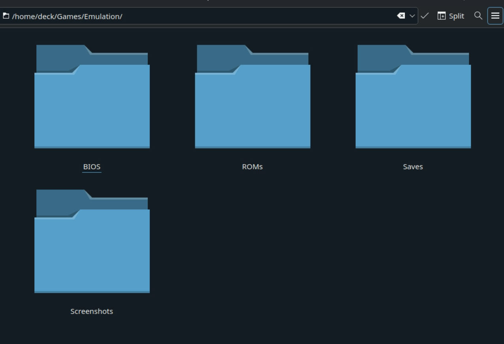
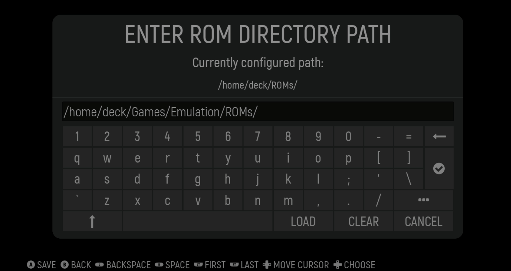
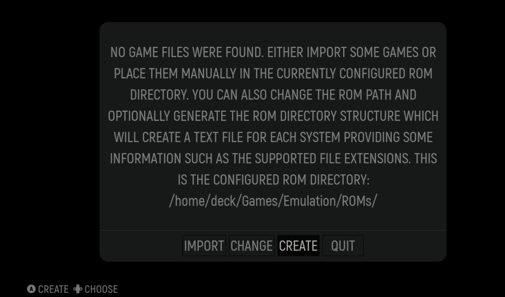
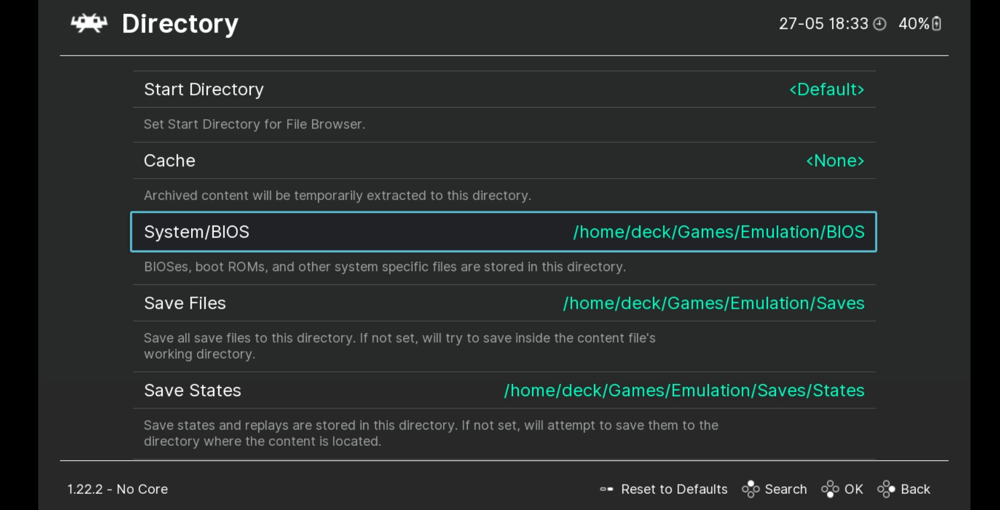
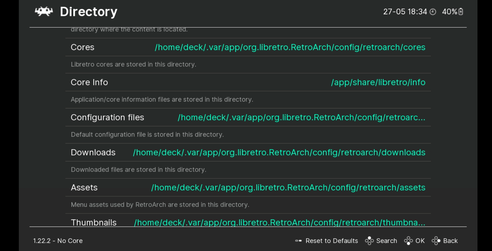
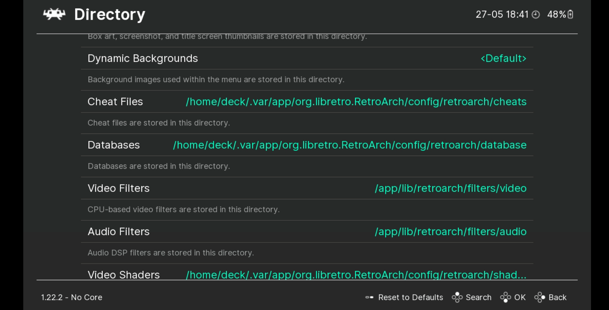
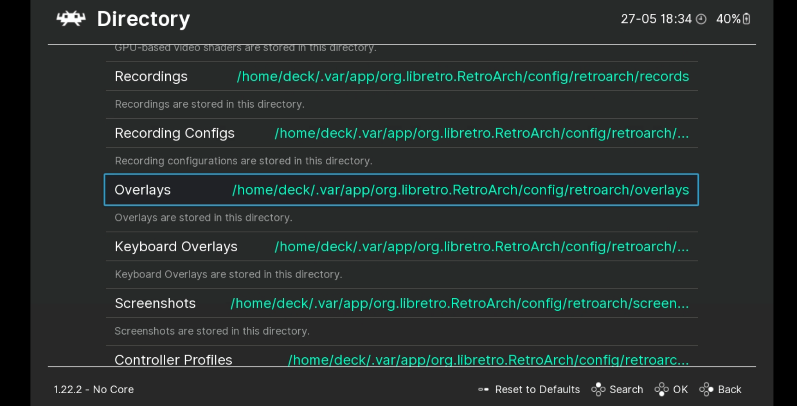
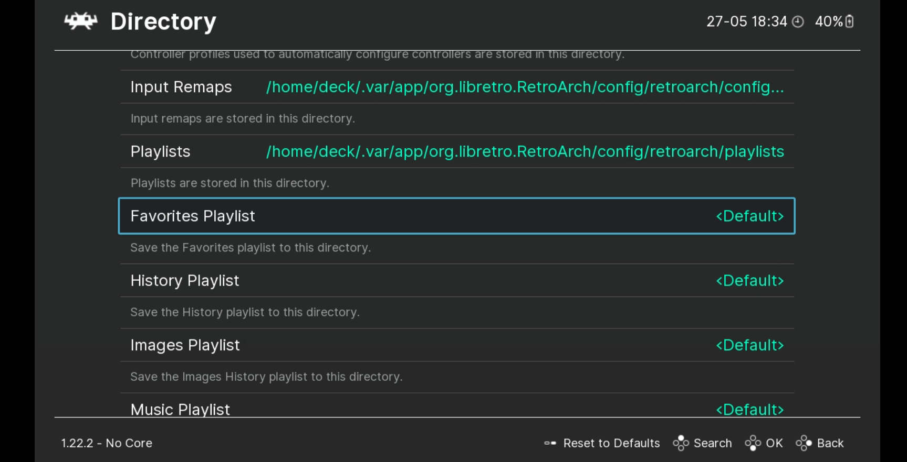
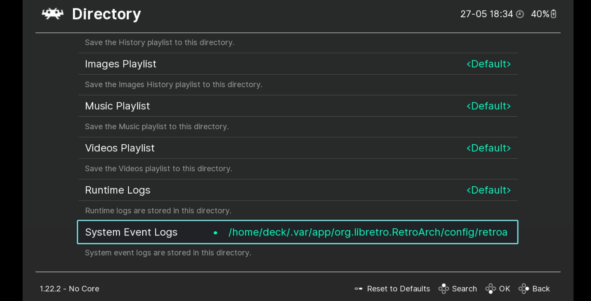

# First Steps

## First Steps Table of Contents

[TOC]

??? info "The Basics"
    {{ home }} 

    {{ hiddenfolders }}
    
    {{ applications }}

## How to Set up a Basic Emulation Directory

1. In the `$HOME` folder, create a `Games` folder if one does not exist :material-information-outline:{ title="{{ steamdeckdesktopmode }}" }
2. In the `$HOME/Games` folder, create an `Emulation` folder
3. In the `$HOME/Games/Emulation` folder, create the following folders:
   * `BIOS`
   * `ROMs`
   * `Saves`
     * In the `Saves` folder, create a `States` folder
   * `Screenshots`
4. The final directory should look like the following image:
    * 

## How to Set up ES-DE and the ROM Folders

1. Open the ES-DE website, [https://es-de.org/#Download](https://es-de.org/#Download) :material-information-outline:{ title="{{ steamdeckdesktopmode }}" }
2. If on a Linux desktop, click the `Linux x64 AppImage` button. If on a Steam Deck, click the `Steam Deck AppImage`
3. Move the downloaded AppImage to `$HOME/Applications`.
4. Right click the AppImage, {{ permissions }}
5. (Optional) For easier maintenance, rename the AppImage to `ES-DE.AppImage`
6. Double click the AppImage to run ES-DE
7. On the ES-DE onboarding screen, click `CHANGE` and update the path to `$HOME/Games/Emulation/ROMs`
    * 
8. Click the checkmark to confirm the path
9. On the onboarding screen, click `CREATE` to allow ES-DE to create the ROM folders in `$HOME/Games/Emulation/ROMs`
    * 
10. Once ES-DE has created the folders, click `QUIT`
11. ES-DE and the ROM folders are now configured

## How to Set Up and Configure RetroArch

### How to Install RetroArch

1. Open your distro's software manager. :material-information-outline:{ title="{{ steamdeckdesktopmode }}" }
    * {{ discover }}
2. Search for "RetroArch" and click "Install" on the top right of the software page For RetroArch
3. Open Konsole or a terminal of your choice
4. Type the following two lines, one at a time, and press enter after each line:
    * `flatpak override org.libretro.RetroArch --filesystem=host --user`
    * {{ flatseal }}

### How to Configure RetroArch

1. Launch RetroArch :material-information-outline:{ title="{{ steamdeckdesktopmode }}" }
2. Click `Settings` on the left-hand side of the screen
3. Scroll down to `Directory`
4. Use the following format:
    * For directores that start with `/app`, click `Parent Directory` until you see ``$HOME/.var/app/org.libretro.RetroArch/config/retroarch`
    * `System/BIOS`
      *  `$HOME/Games/Emulation/BIOS`
    * `Save Files` 
      * `$HOME/Games/Emulation/Saves`
    * `Save States`
      * `$HOME/Games/Emulation/Saves/States`
    * `Assets`
      *  `$HOME/.var/app/org.libretro.RetroArch/config/retroarch/assets`
    * `Cheats`
      *  `$HOME/.var/app/org.libretro.RetroArch/config/retroarch/cheats`
    * `Databases`
      *  `$HOME/.var/app/org.libretro.RetroArch/config/retroarch/database`
    * `Video Shaders`
      *  `$HOME/.var/app/org.libretro.RetroArch/config/retroarch/shaders`
    * `Overlays`
      *  `$HOME/.var/app/org.libretro.RetroArch/config/retroarch/overlays`  
    * `Screenshots`
      *  `$HOME/Games/Emulation/Screenshots`
    * `Controller Profiles`
      *  `$HOME/.var/app/org.libretro.RetroArch/config//retroarch/autoconfig`  
    * The final configuration screen should look similar to the image below:
      * 
      * 
      * 
      * 
      * 
      * 
5. Back out of the `Directory` settings and click `Main Menu` on the left-hand side of the screen
6. Click `Configuration File`, click `Save Current Configuration`
7. Back out of the `Configuration File` screen and click `Online Updater`
8. Click the following options, one at a time, waiting for each to complete downloading
    * `Update Assets`
    * `Update Controller Profiles`
    * `Update Cheats`
    * `Update Databases`
    * `Update Overlays`
    * `Update Cg Shaders`
    * `Update GLSL Shaders`
    * `Core System Files Downloader` > `PPSSPP.zip`
9. Optionally, click `Core Downloader` and select which cores you would like to use. If you would like to download in batch,skip to [How to Download RetroArch Cores in Batch](#how-to-download-retroarch-cores-in-batch). Otherwise, RetroArch is now configured

### How to Download RetroArch Cores in Batch

1. Open the RetroArch buildbot website, [https://buildbot.libretro.com/](https://buildbot.libretro.com/)
2. click `Stable`, locate the latest version (look at the dates), click `linux`, `x86_64`
3. Download `RetroArch_cores.7z`
4. Right click `RetroArch_cores.7z`, click `Extract` > `Extract Here` which will extract it to a `RetroArch-Linux-x86-64` folder
5. Open the newly extracted folder and navigate through the subfolders until you locate the `cores` folder
6. Right click the `cores` folder, click `Copy`, navigate to ``$HOME/.var/app/org.libretro.RetroArch/config/retroarch`
7. Right click anywhere in the folder, click `Paste`, click `Write Into`
8. All of the RetroArch cores are now downloaded

### RetroArch Recommended Settings

1. Launch RetroArch :material-information-outline:{ title="{{ steamdeckdesktopmode }}" }
2. Click `Settings` on the left-hand side of the screen
3. Scroll down to `Video`
4. Click `Output`, `Video`, and select `vulkan`
5. Back out to the `Video` settings, click `Fullscreen Mode`, and click `Fullscreen Display` to enable it
6. Back out to the `Settings` menu, click `Audio`, click `Output`, `Audio`, select `Pulsewire`
7. Back out to the `Audio` menu, click `Microphone`, `Microphone`, and select `sdl2`
8. Back out to the `Settings` menu, click `Input`, `Controller`, and select `sdl2`
9. Back out to the `Input` menu, click `Controller`, and select `sdl2`
10. Back out to the `Settings` menu, click `Main Menu` on the left-hand side of the screen, click `Configuration File`, click `Save Current Configuration`

### How to Configure Hotkeys

1. Launch RetroArch :material-information-outline:{ title="{{ steamdeckdesktopmode }}" }
2. Click `Settings` on the left-hand side of the screen
3. Scroll down to `Input`
4. Click `Hotkeys`
5. Click `Hotkey` enable and press `Select` on your controller
6. Use the following format:
    * `Menu Toggle (Controller Combo)`
      *  `L3 + R3`
    * `Menu Toggle`
      *  `R3`
    * `Quit (Controller Combo)`
      *  `Start + Select`
    * `Reset`
      *  `L3`
    * `Fast Forward (Toggle)`
      *  `R2`
    * `Rewind`
      *  `L2`
    * `Pause`
      *  `A`
    * `Save State`
      *  `R1`  
    * `Load State`
      *  `L1`
    * `Next Save State Slot`
      *  `DPad Right`  
    * `Previous Save State Slot`
      *  `DPad Left`
    * `Next Disc`
      *  `Y`
    * `Take Screenshot`
      *  `B`
7. Back out to the `Settings` menu, click `Main Menu` on the left-hand side of the screen, click `Configuration File`, click `Save Current Configuration`

## How to Play a Game in ES-DE Using RetroArch

This section will use Apotris, a homebrew Tetris game for the Game Boy Advance as an example

1. Open [https://akouzoukos.com/apotris/downloads](https://akouzoukos.com/apotris/downloads) on a browser of your choice
2. Click `GameBoy Advance` under `Downloads`
3. Extract the newly downloaded `.zip` file
4. In the newly extracted folder, move `Apotris.gba` to `$HOME/Games/Emulation/ROMs/gba`
5. Open ES-DE
6. Apotris should now appear under the `GameBoy Advance` collection
7. On the `Apotris` entry, click `Select`, `Edit This Game's Metadata`, `Alternative Emulator` and confirm `mGBA [SYSTEM-WIDE]` is selected
8. Save the changes and launch the `ROM` by selecting it, it should now open in RetroArch